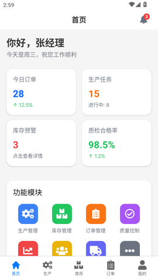
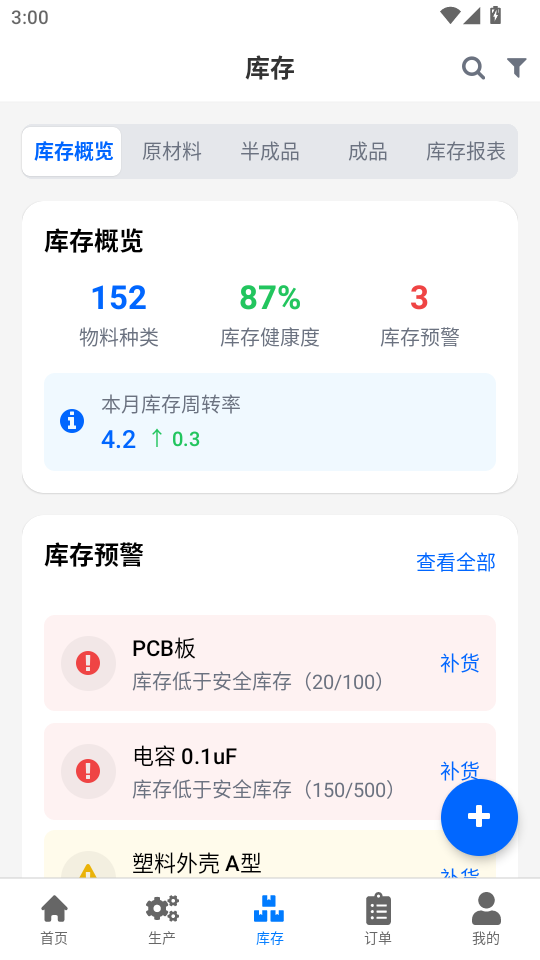

<h1 align="center">
  <br/>
EU-Admin App </h1>

📱 A React Native project 🚀, Made with developer experience and performance first: Expo, TypeScript, TailwindCSS, Husky, Lint-Staged, expo-router, react-query, react-hook-form, I18n.

> This Project is based on [Expo](https://docs.expo.dev/)
> 👉 Supports hot updates







## Requirements

- [React Native dev environment ](https://reactnative.dev/docs/environment-setup)
- [Node.js LTS release](https://nodejs.org/en/)
- [Git](https://git-scm.com/)
- [Watchman](https://facebook.github.io/watchman/docs/install#buildinstall), required only for macOS or Linux users
- [Pnpm](https://pnpm.io/installation)
- [Cursor](https://www.cursor.com/) or [VS Code Editor](https://code.visualstudio.com/download) ⚠️ Make sure to install all recommended extension from `.vscode/extensions.json`

## 👋 Quick start

Clone the repo to your machine and install deps :

```sh
git clone https://github.com/xiaochanghai/eu.admin.reactnative

cd ./eu.admin.reactnative

pnpm install
```

To run the app on ios

```sh
npm run ios
```

To run the app on Android

```sh
npm run android
```

## ✍️ Documentation

- [Rules and Conventions](https://starter.obytes.com/getting-started/rules-and-conventions/)
- [Project structure](https://starter.obytes.com/getting-started/project-structure)
- [Environment vars and config](https://starter.obytes.com/getting-started/environment-vars-config)
- [UI and Theming](https://starter.obytes.com/ui-and-theme/ui-theming)
- [Components](https://starter.obytes.com/ui-and-theme/components)
- [Forms](https://starter.obytes.com/ui-and-theme/Forms)
- [Data fetching](https://starter.obytes.com/guides/data-fetching)
- [Contribute to starter](https://starter.obytes.com/how-to-contribute/)

## 💎 Libraries used

- [Expo](https://docs.expo.io/)
- [Expo Router](https://docs.expo.dev/router/introduction/)
- [Nativewind](https://www.nativewind.dev/v4/overview)
- [Flash list](https://github.com/Shopify/flash-list)
- [React Query](https://tanstack.com/query/v4)
- [Axios](https://axios-http.com/docs/intro)
- [React Hook Form](https://react-hook-form.com/)
- [i18next](https://www.i18next.com/)
- [zustand](https://github.com/pmndrs/zustand)
- [React Native MMKV](https://github.com/mrousavy/react-native-mmkv)
- [React Native Gesture Handler](https://docs.swmansion.com/react-native-gesture-handler/docs/)
- [React Native Reanimated](https://docs.swmansion.com/react-native-reanimated/docs/)
- [React Native Svg](https://github.com/software-mansion/react-native-svg)
- [React Error Boundaries](https://github.com/bvaughn/react-error-boundary)
- [Expo Image](https://docs.expo.dev/versions/unversioned/sdk/image/)
- [React Native Keyboard Controller](https://github.com/kirillzyusko/react-native-keyboard-controller)
- [Moti](https://moti.fyi/)
- [React Native Safe Area Context](https://github.com/th3rdwave/react-native-safe-area-context)
- [React Native Screens](https://github.com/software-mansion/react-native-screens)
- [Tailwind Variants](https://www.tailwind-variants.org/)
- [Zod](https://zod.dev/)

## 🔖 License

This project is MIT licensed.

## 🔖 Other

[APi](https://gitee.com/xiaochanghai520/eu-admin)
